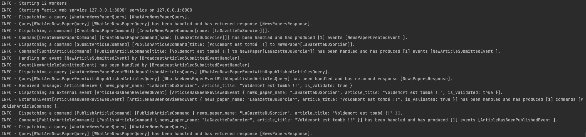

# Sample
For this sample, we will use the following fictive event storming.  

## complex-4dk-sample-integrated-with-actix-and-kafka

### Diesel
<a href="https://diesel.rs/">Diesel</a> is a famous Rust ORM.

### Actix
<a href="https://actix.rs/">Actix</a> is a famous Rust web framework.

### Kafka
<a href="https://github.com/kafka-rust/kafka-rust">Kafka</a> is a rust kafka client.

## Test

### Unit Test
`make test-unit`

### Integration Test
`make test-integration`

### All Test
`make test`

## Endpoint
### Kafka
publish message such as  `{"news_paper_name": "LeJournalDuSorcier", "article_title": "Le mage noir est vaincu", "is_validate": true}` in `article.review` topic

### API HTTP
GET http://locahost:8000/news_paper  
GET http://locahost:8000/admin/news_paper  
POST http://localhost:8000/news_paper  
POST http://localhost:8000/news_paper/{name}/articles  

## Start the sample
### start for dev
Please enter the following commands:
- `make install-diesel-cli` : install diesel cli (optional)
- `make start-infra` : start the postgres database and kafka broker
- `make init-db` : run diesel migration
- `make start-dev` : start the server

### start for prod
Please enter the following commands:
- `make install-diesel-cli` : install diesel cli (optional)
- `make start-infra` : start the postgres database and kafka broker
- `make init-db` : run diesel migration
- `make release` : build for prod the app
- `make start-release` : start the server

## Benefits all such architecture

### Log

With just some loggers in middleware, we have traced with success all app behaviour.

