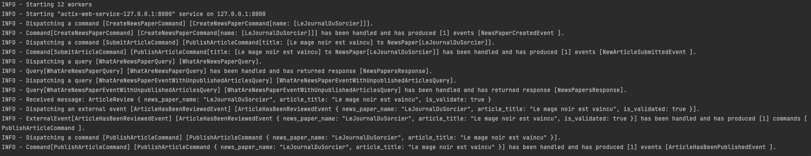

# Sample

## complex-4dk-sample-integrated-with-rocket-and-sqlx

### SQLx
<a href="https://github.com/launchbadge/sqlx">SQLx</a> is a famous SQL library.

### Rocket
<a href="https://rocket.rs/">Rocket</a> is a famous Rust web framework.

## Test

### All Test
`make start-db`
`make init-db`
`make test`

## Endpoint
### API HTTP
GET http://locahost:8000/task  
POST http://localhost:8000/task  
PUT http://localhost:8000/task/{id}  
DELETE http://localhost:8000/task/{id}  

## Start the sample
### start for prod
Please enter the following commands:
- `make start-db` : start the postgres database
- `make init-db` : init database
- `make release` : build for prod the app
- `make start-release` : start the server

## Benefits of such architecture
### Design
Events storming and source code share the same vocabulary and the same workflows.

### Log

With just some loggers in middleware, we have traced with success all app behaviour.

