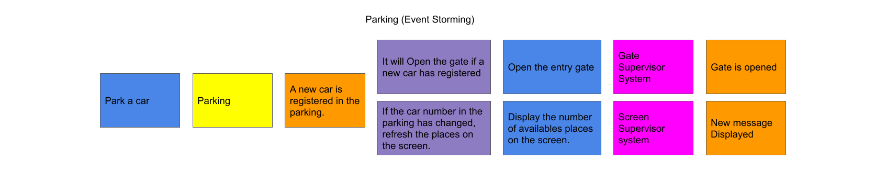

# Sample
For this sample, we will use the following fictive event storming.  

## basic-4dk-sample
Basic implementation.  

`Application` class is the commandBus. (so the entry point of command)
The commandbus is made of 3 middlewares:
* `CommandDispatcher` : dispatch the command to the correct commandhandler
* `CommandLoggingMiddleware`: Log the command before and after has been handled. It does not need to have any logger else in the code.
* `EventsProducedByCommandBusDispatcher`: Dispatch the events produced to the eventBus

The eventBus is only made with the `EventDispatcher` which is injected in the `EventsProducedByCommandBusDispatcher` middleware. 

## From the event storming to the code

### Aggregate (yellow post it)

`Parking`: matches with the parking aggregate. `Parking` class has all the business decisions regarding the aggregate. The decision to know if the car can be parked is implemented in this class. 

### External System (pink post it)

`GateRepository`: matches with the external system "Gate supervisor system"  
`ScreenRepository`: matches with the external system "Screen supervisor system"

### Command (blue post it)

* `ParkACarCommand`: matches with the event storming command. The `ParkACarCommandHandler` is triggered by the command and makes the glue between persistence infrastructure and the decision rule. The aggregate is instanciated in the handler and the events produced by the aggregate are returned in this handler to. 
It is the commandbus which dispatch the command to this handler.

### Domain Event (Orange post it)

`ACarParHasBEenRefusedEvent`: this event is not represented in the event storming because no behaviour is associated to this event. But it has its importance to audit the system behavior.
`ANewCarIsParkedEvent`: matches with the domain event which is after the aggregate.

### Policy (Purple post it)

*`OpenGateWhenANewCarEnteredEventHandler`: matches with the first policy
*`RefreshScreenWhenAvailableSpotHasChangedEventHandler`: matches with the second policy

Warning: an eventHandler does not only represent policy. it could be used to construct a read model or to forward the event to an external bus or to another domain.

### Conclusion
The event storming is a meeting which is made with all your team. In addition to make everyone of the team agree on behavior and the vocabulary, it has designed your software.